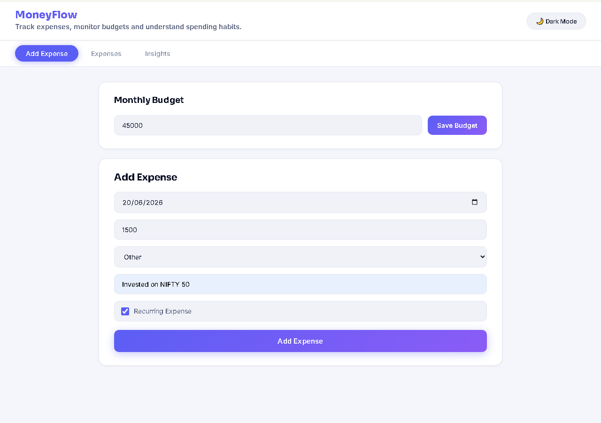
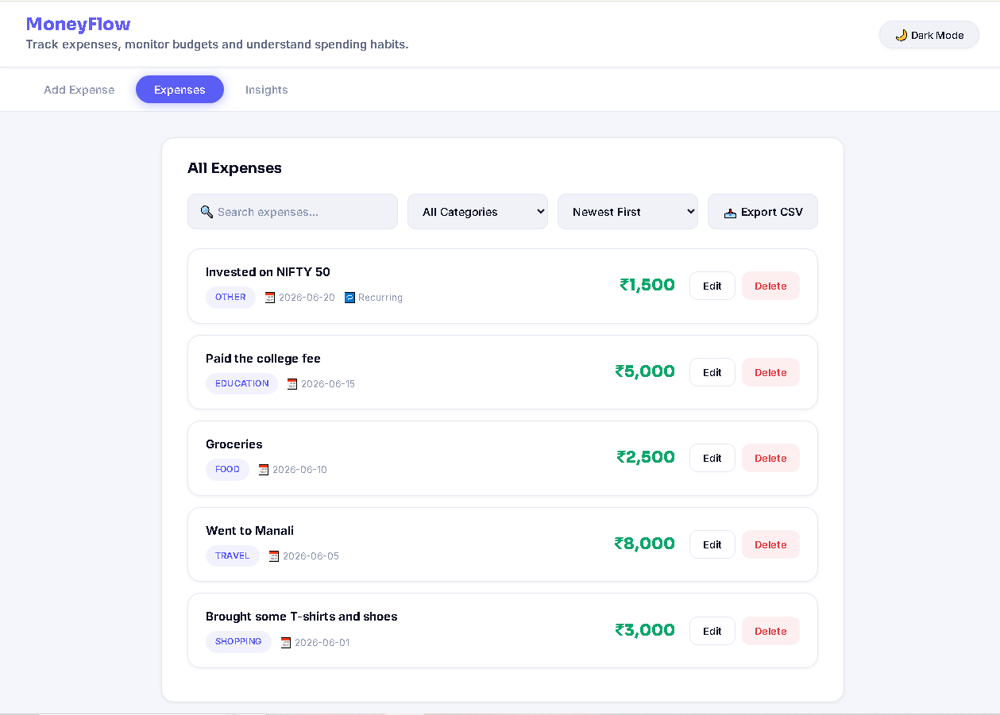
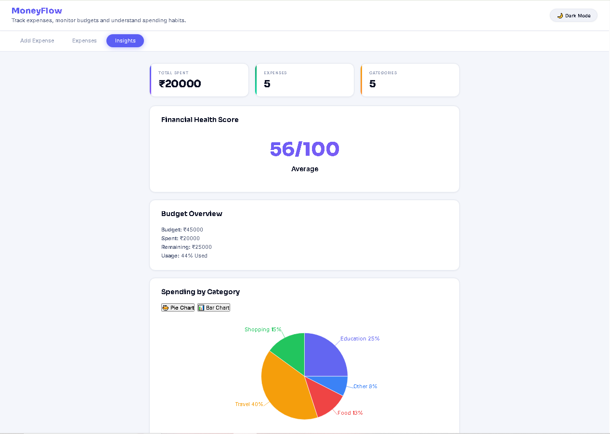
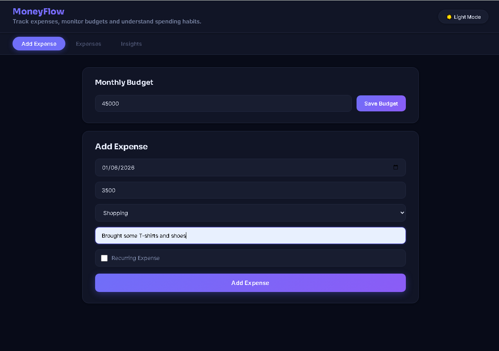

# 💸 Money Flow

Money Flow is a modern expense tracking web application built with React and Vite.

Track expenses, monitor budgets, and understand spending habits through powerful analytics, visual charts, and an intuitive user interface.

---

## 🌐 Live Demo

https://money-flow-five-beige.vercel.app

---

## ✨ Features

### Expense Management
- Add expenses
- Edit expenses
- Delete expenses
- Recurring expense support
- Category-based expense tracking

### Budget Management
- Set monthly budget
- Budget overview
- Spending analysis
- Remaining budget calculation
- Budget usage percentage

### Analytics & Insights
- Total amount spent
- Total expenses count
- Total categories count
- Financial Health Score
- Spending insights dashboard

### Charts & Visualization
- Pie Chart for category distribution
- Bar Chart for spending comparison

### Expense Explorer
- Search expenses
- Filter by category
- Sort by:
  - Newest First
  - Oldest First
  - Amount High → Low
  - Amount Low → High
- Export expenses to CSV

### User Experience
- Modern UI/UX
- Responsive design
- Dark Mode support
- Local Storage persistence
- Toast notifications
- Mobile-friendly layout

---

## 📸 Screenshots

### Add Expense Page (Light Mode)



### All Expenses Page (Light Mode)



### Insights Dashboard (Light Mode)



### Add Expense Page (Dark Mode)



---

## 🛠️ Tech Stack

### Frontend
- React
- Vite
- JavaScript (ES6+)

### State Management
- React Context API
- React Hooks

### Styling
- CSS3
- CSS Variables
- Responsive Design

### Data Visualization
- Recharts

### Storage
- Browser Local Storage

### Deployment
- Vercel

---

## 📂 Project Structure

```text
src/
├── components/
│   ├── budget/
│   ├── charts/
│   ├── expenses/
│   └── layout/
│
├── context/
│   └── ExpenseContext.jsx
│
├── pages/
│   ├── Dashboard.jsx
│   └── Summary.jsx
│
├── styles/
│
├── App.jsx
├── main.jsx
```

---

## ⚙️ Installation

Clone the repository:

```bash
git clone https://github.com/mohdrehn0625/MoneyFlow.git
```

Move into the project:

```bash
cd MoneyFlow
```

Install dependencies:

```bash
npm install
```

Run the development server:

```bash
npm run dev
```

Open:

```text
http://localhost:5173
```

---

## 🎯 Application Sections

### ➕ Add Expense
- Monthly Budget
- Budget Saving
- Expense Form
- Financial Health Score

### 📋 All Expenses
- Search Expenses
- Filter by Category
- Sort Expenses
- Export CSV
- Edit Expenses
- Delete Expenses

### 📊 Insights
- Statistics Cards
- Budget Overview
- Financial Health Score
- Pie Chart Analysis
- Bar Chart Analysis

---

## 🔮 Future Improvements

- Custom delete confirmation modal
- User authentication
- Cloud synchronization
- Monthly financial reports
- Expense import/export

---

## 👨‍💻 Author

**Mohammed Rehan**

GitHub: https://github.com/mohdrehn0625

Repository: https://github.com/mohdrehn0625/MoneyFlow

---

## 📄 License

This project is licensed under the MIT License.

---

⭐ If you found this project useful, consider giving it a star on GitHub.